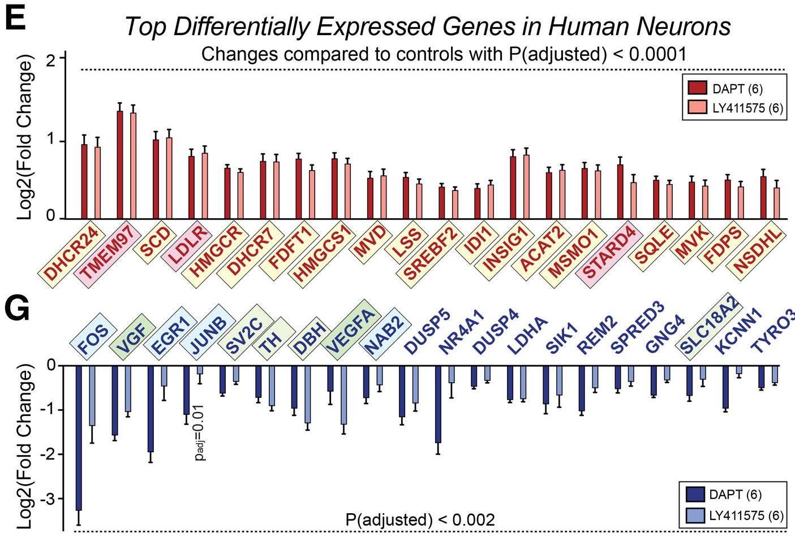

## Brief Overview of Assignment 1
In Assignment #1, a dataset with GEO ID **GSE206102** was downloaded, cleaned,
and normalized for subsequent analysis in the following assignments. The final 
dataset coverage is 14244 genes; each condition ended up having four total 
replicates following normalization.

The RNA-seq experiment associated with this dataset was conducted over six 
biological replicates of induced neuronal cells. There were three treatments: 
control (0.6% DMSO), DAPT(40 uM), and LY411575(2.5 uM). The latter two 
treatments were used to chronically inhibit γ-secretase. γ-secretase 
inhibition is known to lowered cellular cholesterol ester levels and reduce
endocytosis of the low-density lipoprotein receptor (LDLR). However, No studies 
were carried out in human neurons. A more detailed overview about the dataset
in the analysis can be found in the full write-up for Assignment #1.

## Objective of Assignment 2
The object for this assignment is to take the normalized expression data from 
the previous Assignment #1 and rank the genes according to differential 
expression. Once this list ranked, over-representation analysis with thresholds
will be performed to highlight the dominant similarities in the top set of 
genes. 

## Installing dependencies and dowloading the packages
<br>
These dependencies has are already included with the command in the docker file.

```{r setup, message=FALSE}

if (!requireNamespace("BiocManager", quietly = TRUE)){
  install.packages("BiocManager")}

if (!requireNamespace("GEOmetadb", quietly = TRUE)){
  BiocManager::install("GEOmetadb")}

if (!requireNamespace("GEOmetadb", quietly = TRUE)){
  install.packages("knitr")}

if (!requireNamespace("edgeR", quietly = TRUE)){
  BiocManager::install("edgeR")}

if (!requireNamespace("biomaRt", quietly = TRUE)){
  BiocManager::install("biomaRt")}

if (!requireNamespace("DBI", quietly = TRUE)){
  install.packages("DBI")}

if (!requireNamespace("GEOquery", quietly = TRUE)){
  BiocManager::install("GEOquery")}

library(GEOquery)
library(knitr)
library(edgeR)
library(biomaRt)
library(dplyr)
library(purrr)
library(ComplexHeatmap)
library(ggplot2)
library(circlize)
library(gprofiler2)
library(magrittr)
```

## Step 1: Differential Gene Expression
The first step for this assignment is to perform differential gene expression
analysis.

### Loading the normalized data
We must load in the normalized data that was saved from the previous 
assignment.

```{r results = "hide"}
# ensures user does not need to manually run the previous notebook
rmarkdown::render("../A1/A1_KevinZhu.Rmd")
```

```{r eval=TRUE}
# read the file containing information about sample types 
samples_type <- read.table(file=file.path("../A1/GSE206102_samples_type.txt"),
                                    header = TRUE,sep = "\t",
                                    stringsAsFactors = FALSE,
                                    check.names=FALSE)

# read the file containing normalized and filtered counts 
normalized_counts <- read.table(file=file.path(
  "../A1/GSE206102_normalized_filtered_RSEM_counts.txt"
  ),
                                    header = TRUE,sep = "\t",
                                    stringsAsFactors = FALSE,
                                    check.names=FALSE)
dim(normalized_counts)
```

### MDS

We can look at the MDS plot below and see that the samples treated with LY411575
and DAPT cluster fairly tightly and closely with each other. 

```{r eval=TRUE}
d <- DGEList(counts=as.matrix(normalized_counts), 
            group=samples_type$treatment)

# plot multidimensional scaling (MDS) plot
plotMDS(d, labels=NULL, pch = 1, 
        col = c("cyan", "red", "darkgreen")[
          factor(samples_type$treatment)])  

# add legend and title to the plot
title(main = "MDS Plot by treatment")
legend("topright", 
       legend = levels(factor(samples_type$treatment)),
       col = c("cyan", "red", "darkgreen"), 
       pch = 1, 
       cex = 0.7,
       title = "Treatment type")
```
<br /> 
In the experiment, the tissue type, cell line, and cell type were identical for
all the samples. Thus, we will look at the replicates to see if it is a factor
that needs to be considered. 

```{r eval=TRUE}
# create new replicate_number column in samples_type dataframe
samples_type <- samples_type %>%
    mutate(replicate_number = 
             as.numeric(gsub("Replicate([0-9]+)_.*", "\\1", title)))

d <- DGEList(counts=as.matrix(normalized_counts), 
            group=samples_type$replicate_number)

# plot multidimensional scaling (MDS) plot
plotMDS(d, labels=NULL, pch = 1, 
        col = c("cyan", "red", "darkgreen", "black", "violet", "blue")[
          factor(samples_type$replicate_number)])  

# add legend and title to the plot
title(main = "MDS Plot by replicate")
legend("bottomright", 
       legend = levels(factor(samples_type$replicate_number)),
       col = c("cyan", "red", "darkgreen", "black", "violet", "blue"), 
       pch = 1, 
       cex = 0.7,
       title = "Replicate number")
```
<br /> 
Note that not all of the data for each of the replicates is being used, due to 
how the data was processed by GEO (explained in more detail in Assignment #1).
However, even with the few scattered data points, we can still somewhat observe
clustering of replicates 4, 5, and 6.

Notice also that there are three treatments: control, LY411575, and DAPT. This 
makes our subsequent analysis more difficult. However, as explained earlier in 
this notebook, both LY411575 and DAPT are used to pharmaceutically induce 
chronic γ-secretase inhibition. In order to maximize the number of samples we
can use in this analysis, we can first try to combine the LY411575, and DAPT
samples under "γ-secretase inhibition" to see if there are any obvious changes
in the RNA-seq data compared to the control. Notably, the MDS plot reveals a 
close clustering of DAPT and LY411575 samples, providing additional support for 
the decision to combine these samples for further analysis.

```{r eval=TRUE}
# create new column to separate control vs gamma_secretase_inhibition
samples_type <- samples_type %>%
  mutate(new_treatment = ifelse(grepl("Vehicle", treatment), 
                                "control", 
                                "gamma_secretase_inhibition"))

```

### Designing the Model

From the MDS plots, we can define a model based on replicate number and the 
two treatment groups (control and γ-secretase inhibition). From there, we can
fit the model to the data. 

```{r eval=TRUE}
d <- DGEList(counts=as.matrix(normalized_counts), 
             group=samples_type$new_treatment)

# design  model matrix using both replicate number and new treatment groups
model_design <- model.matrix(~ samples_type$replicate_number +
                               samples_type$new_treatment)

# estimate dispersion
d <- estimateDisp(d, model_design)

# fit quasi-likelihood negative binomial generalized linear model to the data
fit <- glmQLFit(d, model_design)
```

We can then test for significance using this fitted model. 

```{r eval=TRUE}
# perform significance test
qlf.ctrl_vs_inhibit <- glmQLFTest(fit, coef=ncol(model_design)) 

# extract top hits from test
tt_ctrl_vs_inhibit <- topTags(qlf.ctrl_vs_inhibit, n=nrow(d)) 

# extract results table
top_outputs <- tt_ctrl_vs_inhibit$table 
```

Next, we can identify the genes with p-values and FDR values that pass the 
significance threshold.

```{r eval=TRUE}
# get indices of top outputs with p-value < 0.05
sig_p_idx <- which(top_outputs$PValue < 0.05) 

# get indices of top outputs with FDR < 0.1
sig_fdr_idx <- which(top_outputs$FDR < 0.1) 
num_p <- length(sig_p_idx)
num_fdr <- length(sig_fdr_idx)
```

In this analysis, we have chosen the typical significance threshold α=0.05; we 
can see that `r num_p` genes exhibited statistically significant differential 
expression (their p-values < 0.05).

We used False Discovery Rate (FDR) correction to address multiple hypotheses 
in this analysis. The preference for FDR over Bonferroni's correction stems from 
its relatively less stringent nature, which allows us to keep a broader set of 
significant genes. Notably, it is also the default setting in `glmQLFTest()` 
function. The threshold for FDR was set to 0.1 in this analysis, as it was 
the value the authors used in the original paper (Essayan-Perez & Südhof 2024).

Applying the standard significance threshold, this time considering 
the FDR, our analysis identifies `r num_fdr` genes exhibiting significant 
differential expression.

### Volcano Plot
To concisely visualize our analysis, we can us a volcano plot, as shown below. 
Within this plot, we emphasize genes of significance—those exhibiting an 
FDR < 0.1 and an absolute log2 fold change exceeding 0.25. The classification 
of these genes as upregulated or downregulated is determined by the sign of 
their respective log2 fold changes.

```{r eval=TRUE}
# label top hits with differential expression status
top_outputs$diffexpressed <- 
  ifelse(top_outputs$logFC > 0.25 & top_outputs$FDR < 0.1, 
         "Upregulated",
         ifelse(top_outputs$logFC < -0.25 & top_outputs$FDR < 0.1, 
                "Downregulated", 
                "No change"))

# define colors based on differential expression status
cols <- ifelse(top_outputs$logFC > 0.25 & top_outputs$FDR < 0.1, 
               "cornflowerblue",
               ifelse(top_outputs$logFC < -0.25 & top_outputs$FDR < 0.1, 
                      "orange", 
                      "grey"))

# create scatter plot
ggplot(data = top_outputs, 
       aes(x = logFC, y = -log10(FDR), col = diffexpressed)) + 
  geom_point() + 
  scale_color_manual(values = c("orange", "grey", "cornflowerblue")) + 
  geom_hline(yintercept = -log10(0.1), col = "black", lty = 2) + 
  geom_vline(xintercept = c(-0.25, 0.25), col = "black", lty = 2) +
  ggtitle("Volcano Plot of Differential Expression")
```

### Heatmap
We can now generate a heatmap to illustrate the scaled differences in 
normalized RNA counts among the top hits.

```{r eval=TRUE}
# get names of significant genes
sig_genes <- rownames(top_outputs)[sig_fdr_idx] 

# get indices of significant genes in counts data
sig_baseline_idx <- which(rownames(normalized_counts) %in% sig_genes) 

# scale the data
scaled_hits_heatmap_matrix <- t(
  scale(t(as.matrix(normalized_counts[sig_baseline_idx,])))) 

# create the colorscales based on if there are negative scaled count values
if(min(scaled_hits_heatmap_matrix) < 0){
  colscale <- colorRamp2(c(min(scaled_hits_heatmap_matrix), 
                           0, max(scaled_hits_heatmap_matrix)),
                           c("cornflowerblue", "white", "orange"))
} else {
  colscale <- colorRamp2(c(min(scaled_hits_heatmap_matrix), 
                           max(scaled_hits_heatmap_matrix)), 
                           c("white", "orange"))
}


# create heatmap
Heatmap(scaled_hits_heatmap_matrix,
        cluster_rows = TRUE,
        cluster_columns = TRUE,
        show_row_dend=TRUE,
        col = colscale,
        show_column_names = TRUE,
        show_row_names = FALSE,
        show_heatmap_legend=TRUE,
        name = "Scaled Expression"
        )
```

We can see in the heatmap above that the samples treated with DAPT and LY411575
all seem to cluster together, separate from the control samples. As mentioned 
earlier, this behavior was expected as both treatments were intended to 
pharmaceutically induce chronic γ-secretase inhibition; their 
transcriptomes would be relatively similar. Notably, there is a distinct 
difference in the expression of the top hits between the control and treated 
conditions, which somewhat affirms our methodology. 

## Thresholded overrepresentation analysis

As shown below, we conducted a threshold gene set enrichment analysis on the top
hits, using for `g:Profiler` as the tool of choice. This decision was driven by
pre-existing familiarity with the interface. Furthermore, the use 
of g:Profiler enables us to deduce enriched biological pathways and functional 
annotations associated with top hits, enhancing the interpretation of our 
analysis.

The thresholded lists were generated based on an FDR < 0.01 and whether the log 
fold change is greater than or less than zero, along with the entire list.

```{r eval=TRUE}
# get indices of significant upregulated and downregulated
up_idx <- which(tt_ctrl_vs_inhibit$table$FDR < 0.01 & 
                  tt_ctrl_vs_inhibit$table$logFC > 0)
down_idx <- which(tt_ctrl_vs_inhibit$table$FDR < 0.01 & 
                    tt_ctrl_vs_inhibit$table$logFC < 0)

# get gene names of upregulated genes
upreg <- tt_ctrl_vs_inhibit$table[up_idx,]
upreg_list <- rownames(upreg)

# get gene names of downregulated genes
downreg <- tt_ctrl_vs_inhibit$table[down_idx,]
downreg_list <- rownames(downreg)
```

Using `g:Profiler` on the upregulated and downregulated lists, we can perform 
a thresholded over-representation analysis to identify a number of pathways and
genesets for each query. 

```{r eval=TRUE}

# query gprofiler for upregulated list
gostres_up <- gost(query = upreg_list, 
                organism = "hsapiens", significant = FALSE, exclude_iea = TRUE, 
                correction_method = "fdr", 
                domain_scope = "annotated", 
                numeric_ns = "", sources = c("GO:BP", "REAC", "WP"))
 
# query gprofiler for downregulated list
gostres_down <- gost(query = downreg_list, 
                organism = "hsapiens", significant = FALSE, exclude_iea = TRUE, 
                correction_method = "fdr", 
                domain_scope = "annotated", 
                numeric_ns = "", sources = c("GO:BP", "REAC", "WP"))

# query gprofiler for whole list
gostres <-  gost(query = c(upreg_list, downreg_list), 
                organism = "hsapiens", significant = FALSE, exclude_iea = TRUE, 
                correction_method = "fdr", 
                domain_scope = "annotated", 
                numeric_ns = "", sources = c("GO:BP", "REAC", "WP"))

num_genesets_up <- nrow(gostres_up$result)
num_genesets_down <- nrow(gostres_down$result)
num_genesets_all <- nrow(gostres$result)
```

Next, we can filter out terms that are too large, as they may obscure relevant
pathways. Instead, we take only genesets with a term size that is less than or 
equal to 200 (similar thresholds in the `g:Profiler` homework assignment).

```{r eval=TRUE}
# filter for terms with term_size <= 200
filtered_gos_up <- gostres_up$result[which(gostres_up$result$term_size <= 200),]
filtered_gos_down <- gostres_down$result[which(gostres_down$result$term_size <= 200),]
filtered_gos <- gostres$result[which(gostres$result$term_size <= 200),]
```

This analysis incorporates GO biological process, Reactome, and WikiPathways 
as annotation databases. This selections aligns with our goal on uncovering 
enriched biological pathways associated with the identified genes. Note that 
electronic GO annotations were exluded to ensure that only high-quality 
annotations were being used in our analysis. 

Applying thresholds of FDR < 0.1, we identify `r num_genesets_up` genesets for 
upregulated genes (logFC > 0), `r num_genesets_down` for downregulated genes 
(logFC > 0), and `r num_genesets_all` for the combined list. Upon further 
refinement by filtering for term sizes less than or equal to 200, our analysis 
yields `r nrow(filtered_gos_up)` genesets for upregulated genes, 
`r nrow(filtered_gos_down)` for downregulated genes, and `r nrow(filtered_gos)` 
for the combined list. This step ensures a focus on more specific and 
biologically relevant genesets within the enriched pathways and processes.


```{r eval=TRUE}
# select first 12 rows and columns ("term_name" and "p_value") from data frame
filtered_gos_up[1:12,c("term_name", "p_value")] %>% 
  kable(caption="Table 1. Top filtered pathways hits for upregulated genes.", 
      row.names = FALSE, digits = 32)
```

```{r eval=TRUE}
# select first 12 rows and columns ("term_name" and "p_value") from data frame
filtered_gos_down[1:12,c("term_name", "p_value")] %>% 
  kable(caption="Table 2. Top filtered pathways hits for downregulated genes.", 
      row.names = FALSE, digits = 52)
```

```{r eval=TRUE}
# select first 12 rows and columns ("term_name" and "p_value") from data frame
filtered_gos[1:12, c("term_name", "p_value")] %>% 
  kable(caption="Table 3. Top filtered pathways hits for differentially expressed genes.", 
      row.names = FALSE, digits = 32)
```

We can observe from the three tables above that the pathways associated with the 
upregulated genes seem to be the ones that primarily reappear when performing 
the analysis on the entire list of genes. This may be because the upregulated 
genes all seem to be associated with biosynthesis pathways, particularly those 
related to cholesterol and its precursors. In contrast, the downregulated genes 
exhibit a more diverse involvement in various pathways. This heterogeneity in 
pathways among downregulated genes likely muddles the signal when performing 
the thresholded analysis over all the genes, which may be why we see different 
results. 

## Interpretation
The results from this analysis seem to closely match the results from the 
original paper (Essayan-Perez & Südhof 2024). Notably, the authors observed that 
all the unregulated genes induced by chronic γ-secretase inhibition in human 
neuronal cells were associated with cholesterol biosynthesis pathways 
(Figure 4E). As seen in the table above, the genes that were most significantly 
affected by the DAPT or LY411575 treatment were those involved in the 
biosynthesis of cholesterol and precursors. 




<br /> 
Furthermore, the down-regulated genes were also described as being relatively 
heterogeneous in terms of function and pathway (Figure 4G), suggesting a less 
direct correlation with γ-secretase levels. This is also corroborated by the 
g:Profiler analysis.


Other sources of literature seems to support the conclusions in the paper. In 
"Inhibition of Cholesterol Biosynthesis Reduces γ-Secretase Activity and 
Amyloid-β Generation," (Kim et al., 2016), a relationship between γ-secretase 
and cholesterol biosynthesis is similarly identified, although in the inverse 
direction. More specifically, the authors of the paper depleted cholesterol 
using AY49944, which blocks the final step of cholesterol biosynthesis. The 
application of this diamine demonstrated a notable reduction in γ-secretase 
activity, further reinforcing the observed link between cholesterol metabolism 
and γ-secretase function. 

## References
\setlength{\parindent}{-0.2in}
\setlength{\leftskip}{0.2in}
\setlength{\parskip}{8pt}
\noindent

<div style="text-indent: -40px; padding-left: 40px;">
Bache S, Wickham H (2022). _magrittr: A Forward-Pipe Operator for R_. R package 
version 2.0.3, https://github.com/tidyverse/magrittr, 
<https://magrittr.tidyverse.org>.

Davis, S. and Meltzer, P. S. GEOquery: a bridge between the Gene Expression 
Omnibus (GEO) and BioConductor. Bioinformatics, 2007, 14, 1846-1847

Essayan-Perez, Sofia, and Thomas C Südhof. “Neuronal γ-Secretase Regulates 
Lipid Metabolism, Linking Cholesterol to Synaptic Dysfunction in Alzheimer’s 
Disease.” Neuron, vol. 111, no. 20, 1 Oct. 2023, pp. 3176-3194.e7, 
https://doi.org/10.1016/j.neuron.2023.07.005.

Gu Z, Eils R, Schlesner M (2016). “Complex heatmaps reveal patterns and 
correlations in multidimensional genomic data.” Bioinformatics. 
doi:10.1093/bioinformatics/btw313.

Gu Z (2022). “Complex Heatmap Visualization.” iMeta. doi:10.1002/imt2.43.

Gu Z, Gu L, Eils R, Schlesner M, Brors B (2014). “circlize implements and 
enhances circular visualization in R.” Bioinformatics, 30, 2811-2812.

Kim, Y., Kim, C., Jang, H. Y., & Mook-Jung, I. (2016). Inhibition of 
cholesterol biosynthesis reduces γ-secretase activity and amyloid-β generation. 
Journal of Alzheimer’s Disease, 51(4), 1057–1068. 
https://doi.org/10.3233/jad-150982 

Kolberg L, Raudvere U, Kuzmin I, Vilo J, Peterson H (2020). “gprofiler2– an 
R package for gene list functional enrichment analysis and namespace conversion 
toolset g:Profiler.” F1000Research, 9 (ELIXIR)(709). R package version 0.2.3.

Martin, Fergal J., et al. “Ensembl 2023.” Nucleic Acids Research, 
vol. 51, no. D1, 6 Jan. 2023, pp. D933–D941, pubmed.ncbi.nlm.nih.gov/36318249/, 
https://doi.org/10.1093/nar/gkac958.

Robinson MD, McCarthy DJ and Smyth GK (2010). edgeR: a Bioconductor package for 
differential expression analysis of digital gene expression data. 
Bioinformatics 26, 139-140

Wickham H (2016). ggplot2: Elegant Graphics for Data Analysis. Springer-Verlag 
New York. ISBN 978-3-319-24277-4, https://ggplot2.tidyverse.org.
  
Wickham H, Henry L (2023). _purrr: Functional Programming Tools_. R package 
version 1.0.2, https://github.com/tidyverse/purrr, 
<https://purrr.tidyverse.org/>.

Wickham H, François R, Henry L, Müller K, Vaughan D (2023). _dplyr: A Grammar 
of Data Manipulation_. R package version 1.1.4, 
<https://CRAN.R-project.org/package=dplyr>.
  
Yihui Xie (2015) Dynamic Documents with R and knitr. 2nd edition. Chapman and 
Hall/CRC. ISBN 978-1498716963

Mapping identifiers for the integration of genomic datasets with the 
R/Bioconductor package biomaRt. Steffen Durinck, Paul T. Spellman, Ewan Birney 
and Wolfgang Huber, Nature Protocols 4, 1184-1191 (2009).
</div>

