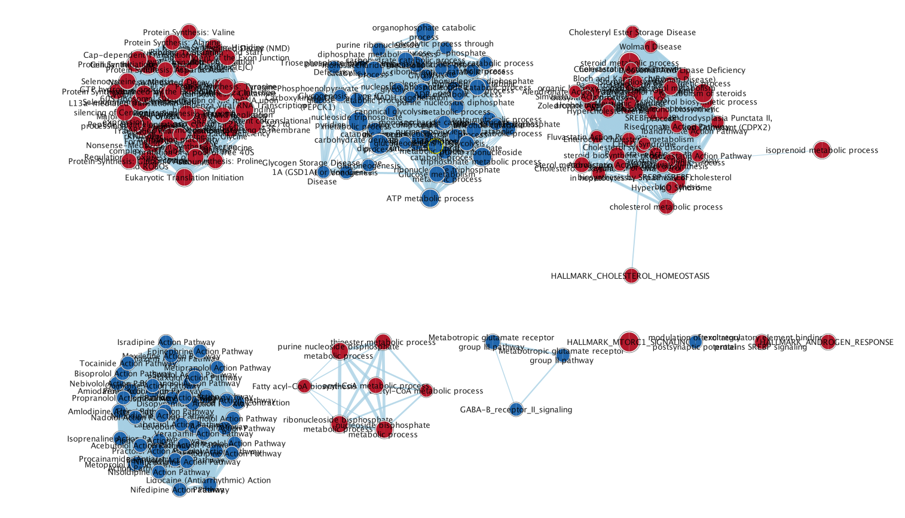
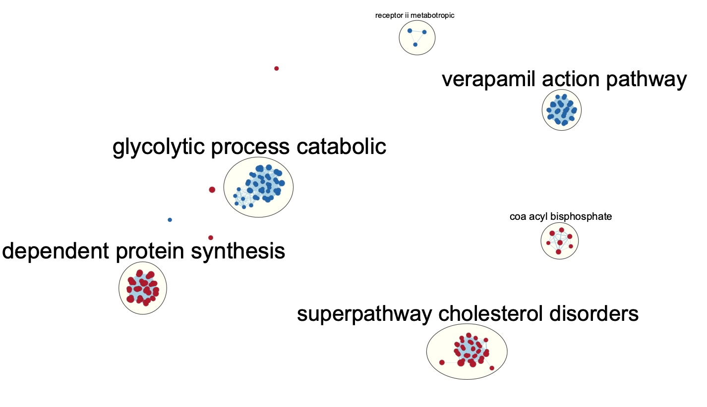

## Brief Overview of Assignment 1 and 2
In Assignment #1, a dataset with GEO ID **GSE206102** was downloaded, cleaned,
and normalized for subsequent analysis in the following assignments. The final 
dataset coverage is 14244 genes; each condition ended up having four total 
replicates following normalization.

The RNA-seq experiment associated with this dataset was conducted over six 
biological replicates of induced neuronal cells. There were three treatments: 
control (0.6% DMSO), DAPT(40 uM), and LY411575(2.5 uM). The latter two 
treatments were used to chronically inhibit γ-secretase. γ-secretase 
inhibition is known to lowered cellular cholesterol ester levels and reduce
endocytosis of the low-density lipoprotein receptor (LDLR). However, No studies 
were carried out in human neurons. A more detailed overview about the dataset
in the analysis can be found in the full write-up for Assignment #1.

In Assignment #2, the normalized expression data from the previous assignment
was used to rank the genes according to differential expression. With this 
ranked list, we performed over-representation analysis with thresholds to 
highlight the dominant similarities in the top set of genes. 
Through this analysis, 91 and 437 genes were identified as being statistically 
signficant when using FDR < 0.1 and p < 0.05 as a cutoff respectively. 

Finally, a thresholded gene set enrichment analysis was performed using 
G:Profiler. Applying thresholds of FDR < 0.1, we identify 1153 genesets for 
upregulated genes (logFC > 0), 1330 for downregulated genes (logFC > 0), and 
1957 for the combined list. Upon further refinement by filtering for term sizes 
less than or equal to 200, our analysis yields 678 genesets for upregulated 
genes, 795 for downregulated genes, and 1333 for the combined list.

## Objective of Assignment 3
The object for this assignment is to conduct non-thresholded gene set 
enrichment analysis using the ranked set of genes from Assignment #2. We will 
then compare these findings to the results from the thresholded analysis in the
previous assignment. 

## Installing dependencies and dowloading the packages
<br>
These dependencies has are already included with the command in the docker file.

```{r setup, message=FALSE}

if (!requireNamespace("BiocManager", quietly = TRUE)){
  install.packages("BiocManager")}

if (!requireNamespace("GEOmetadb", quietly = TRUE)){
  BiocManager::install("GEOmetadb")}

if (!requireNamespace("GEOmetadb", quietly = TRUE)){
  install.packages("knitr")}

if (!requireNamespace("edgeR", quietly = TRUE)){
  BiocManager::install("edgeR")}

if (!requireNamespace("biomaRt", quietly = TRUE)){
  BiocManager::install("biomaRt")}

if (!requireNamespace("DBI", quietly = TRUE)){
  install.packages("DBI")}

if (!requireNamespace("GEOquery", quietly = TRUE)){
  BiocManager::install("GEOquery")}

if(! requireNamespace("RCurl")) {
  install.packages("RCurl")}

if(! requireNamespace("RCy3")) {
  BiocManager::install("RCy3")}

if(! requireNamespace("httr")){
  install.packages("httr")} 

if(! requireNamespace("fgsea")){
  install.packages("fgsea")}

library(GEOquery)
library(knitr)
library(edgeR)
library(biomaRt)
library(dplyr)
library(purrr)
library(ComplexHeatmap)
library(ggplot2)
library(circlize)
library(gprofiler2)
library(magrittr)
library(RCy3)
library(httr)
library(RCurl)
library(fgsea)
```

## Step 1: Non-thresholded Gene set Enrichment Analysis
The first step for this assignment is to perform non-thresholded gene set 
enrichment analysis

### Downloading the Gene Set
We must first obtain the Bader gene set before we can begin our analysis if it 
has not been already downloaded. This will be the dataset we use for determining
pathway enrichment in the GSEA analysi. 


```{r results = "hide"}
# Set gene-set file
geneset_file <- "Human_GOBP_AllPathways_noPFOCR_no_GO_iea_March_01_2024_symbol.gmt" 

# Check if geneset does not exist, then download it
if(! file.exists(geneset_file)){
  
  # URL to get most recent gene set
  gmt_url = "http://download.baderlab.org/EM_Genesets/current_release/Human/symbol/"

  # Connect to URL and get html version of the page
  filenames = getURL(gmt_url)
  tc = textConnection(filenames)
  contents = readLines(tc)
  close(tc)
  
  # Create regular expression that will match the relevant file on the html page
  rx = gregexpr("(?<=<a href=\")(.*.GOBP_AllPathways_noPFOCR_no_GO_iea.*.)(.gmt)(?=\">)", contents,
                perl = TRUE)
  
  # Get file names that match the regular expression
  gmt_file = unlist(regmatches(contents, rx))
  
  # Specify path of where to download the file
  geneset_file <- file.path(gmt_file)
  
  # Download the file
  download.file(paste(gmt_url, gmt_file, sep=""), destfile = geneset_file)
}
```

```{r eval=TRUE}
# Get results from differential expression analysis in Assignment 2
de_df <- read.table(file = "top_outputs.txt", header = TRUE, sep = "\t")

# Create ranked dataframe
ranked_list <- data.frame(GeneName = rownames(de_df), 
                          rank = -log(de_df$PValue, base = 10) * sign(de_df$logFC))

# Ordered ranked dataframe in descending order by rank
ranked_list <- ranked_list[order(-ranked_list$rank),]

# Save ranked list
if(! file.exists("a3_ranked.rnk")){
  write.table(ranked_list, "a3_ranked.rnk", quote=FALSE, sep='\t', row.names = FALSE)
}
```

```{r eval=TRUE}
run_gsea = TRUE # Set to TRUE if running GSEA
working_dir <- getwd() # Get path of working directory to download items

# Create path to GSEA shell script
gsea_jar <- file.path(working_dir, "GSEA_4.3.2/gsea-cli.sh")

# Set path to the GSEA directory as blank for automatic detection
gsea_directory = ""

analysis_name <- "control vs gamma_secretase_inhibition" # Set analysis name
rnk_file <- "a3_ranked.rnk" # Set name of pre-ranked file
```

```{r eval=TRUE}
if (run_gsea) {
  
  # Read gene sets from GMT file
  genesets <- gmtPathways(geneset_file)
  
  rank_stats <- ranked_list$rank
  names(rank_stats) <- ranked_list$GeneName
  
  # Run GSEA
  fgseaRes <- fgsea(pathways = genesets, 
                    stats = rank_stats, 
                    minSize  = 15,
                    maxSize  = 200,
                    nperm = 10000)
  
}

```

```{r eval=TRUE}
format_fgsea_results <- function(current_fgsea_results, current_ranks) {
    # Calculate the rank at max
    # fgsea returns the leading edge. Just need to extract the highest rank from 
    # set to get the rank at max
    calculated_rank_at_max <- apply(current_fgsea_results, 1, FUN = function(x) { 
        max(which(names(current_ranks) %in% unlist(x[8])))
    })
    
    # The last column is a comma-separated list of genes that are found in the leading edge.
    # (Technically GSEA doesn't need this and the column will be ignored,
    # but you have to put something in that column, might as put something that might be useful)
    gsea_results <- cbind(current_fgsea_results$pathway,
                          current_fgsea_results$pathway,
                          "Details ...",
                          current_fgsea_results$size,
                          current_fgsea_results$ES,
                          current_fgsea_results$NES,
                          current_fgsea_results$pval,
                          current_fgsea_results$padj,
                          0,
                          calculated_rank_at_max,
                          apply(current_fgsea_results, 1, FUN = function(x) {
                              paste(unlist(x[8]), collapse = ",")
                          })) 
    
    colnames(gsea_results) <- c("name", "description", "GS DETAILS", "SIZE", 
                                "ES", "NES", "pval", "padj", "FWER", 
                                "Rank at Max", "leading edge genes")
    
    return(gsea_results)
}

top_pathways_pos <- format_fgsea_results(fgseaRes[NES > 0], rank_stats)
top_pathways_neg <- format_fgsea_results(fgseaRes[NES < 0], rank_stats)

write.table(top_pathways_pos, 
            file = "gsea_report_for_na_pos.tsv", sep = "\t", 
            row.names = FALSE,
            quote = FALSE)

write.table(top_pathways_neg, 
            file = "gsea_report_for_na_neg.tsv", sep = "\t", 
            row.names = FALSE,
            quote = FALSE)

```

```{r echo=FALSE}
fgseaRes[NES > 0][order(fgseaRes[NES > 0]$padj), ]
fgseaRes[NES < 0][order(fgseaRes[NES > 0]$padj), ]
```

## Visualize Gene set Enrichment Analysis using Cytoscape

The resulting map has 204 nodes and 3865 edges. The node cutoff used for this 
network is FDR Q-value of 0.01, while the edge similarity cutoff was set to
0.375. Below showcases the map without manual layout manipulation.




The parameters used to annotate the network was kept as default. Notably, each 
node indicates a pathway, with its size indicating the number of genes. The
color of the node indicates the phenotype that the pathway is enriched for:
red indicates γ-secretase inhibition, while blue indicates the control group. 
The edges between the nodes indicate the prescence of common genes between the
pathways and its weight represents the number in common. 

After this step, we can annotate our network to visualize the pathways that 
cluster together following this analysis. 



The major themes found in this clusted enrichment map seem to be processes 
governing metabolism, with a notably inclusion of pathways that all seem to 
be involved in cholesterol biosynthesis. This is unsurprising given what the 
conclusions are from the original paper. Furthermore, each cluster seems to 
only contain a single category (either the γ-secretase inhibition or control),
which implies that the clusters fit will with the model. 

## Interpretation and Post-Analysis:


## References
\setlength{\parindent}{-0.2in}
\setlength{\leftskip}{0.2in}
\setlength{\parskip}{8pt}
\noindent

<div style="text-indent: -40px; padding-left: 40px;">
Bache S, Wickham H (2022). _magrittr: A Forward-Pipe Operator for R_. R package 
version 2.0.3, https://github.com/tidyverse/magrittr, 
<https://magrittr.tidyverse.org>.

Davis, S. and Meltzer, P. S. GEOquery: a bridge between the Gene Expression 
Omnibus (GEO) and BioConductor. Bioinformatics, 2007, 14, 1846-1847

Essayan-Perez, Sofia, and Thomas C Südhof. “Neuronal γ-Secretase Regulates 
Lipid Metabolism, Linking Cholesterol to Synaptic Dysfunction in Alzheimer’s 
Disease.” Neuron, vol. 111, no. 20, 1 Oct. 2023, pp. 3176-3194.e7, 
https://doi.org/10.1016/j.neuron.2023.07.005.

Gu Z, Eils R, Schlesner M (2016). “Complex heatmaps reveal patterns and 
correlations in multidimensional genomic data.” Bioinformatics. 
doi:10.1093/bioinformatics/btw313.

Gu Z (2022). “Complex Heatmap Visualization.” iMeta. doi:10.1002/imt2.43.

Gu Z, Gu L, Eils R, Schlesner M, Brors B (2014). “circlize implements and 
enhances circular visualization in R.” Bioinformatics, 30, 2811-2812.

Kim, Y., Kim, C., Jang, H. Y., & Mook-Jung, I. (2016). Inhibition of 
cholesterol biosynthesis reduces γ-secretase activity and amyloid-β generation. 
Journal of Alzheimer’s Disease, 51(4), 1057–1068. 
https://doi.org/10.3233/jad-150982 

Kolberg L, Raudvere U, Kuzmin I, Vilo J, Peterson H (2020). “gprofiler2– an 
R package for gene list functional enrichment analysis and namespace conversion 
toolset g:Profiler.” F1000Research, 9 (ELIXIR)(709). R package version 0.2.3.

Martin, Fergal J., et al. “Ensembl 2023.” Nucleic Acids Research, 
vol. 51, no. D1, 6 Jan. 2023, pp. D933–D941, pubmed.ncbi.nlm.nih.gov/36318249/, 
https://doi.org/10.1093/nar/gkac958.

Robinson MD, McCarthy DJ and Smyth GK (2010). edgeR: a Bioconductor package for 
differential expression analysis of digital gene expression data. 
Bioinformatics 26, 139-140

Wickham H (2016). ggplot2: Elegant Graphics for Data Analysis. Springer-Verlag 
New York. ISBN 978-3-319-24277-4, https://ggplot2.tidyverse.org.
  
Wickham H, Henry L (2023). _purrr: Functional Programming Tools_. R package 
version 1.0.2, https://github.com/tidyverse/purrr, 
<https://purrr.tidyverse.org/>.

Wickham H, François R, Henry L, Müller K, Vaughan D (2023). _dplyr: A Grammar 
of Data Manipulation_. R package version 1.1.4, 
<https://CRAN.R-project.org/package=dplyr>.
  
Yihui Xie (2015) Dynamic Documents with R and knitr. 2nd edition. Chapman and 
Hall/CRC. ISBN 978-1498716963

Mapping identifiers for the integration of genomic datasets with the 
R/Bioconductor package biomaRt. Steffen Durinck, Paul T. Spellman, Ewan Birney 
and Wolfgang Huber, Nature Protocols 4, 1184-1191 (2009).
</div>

