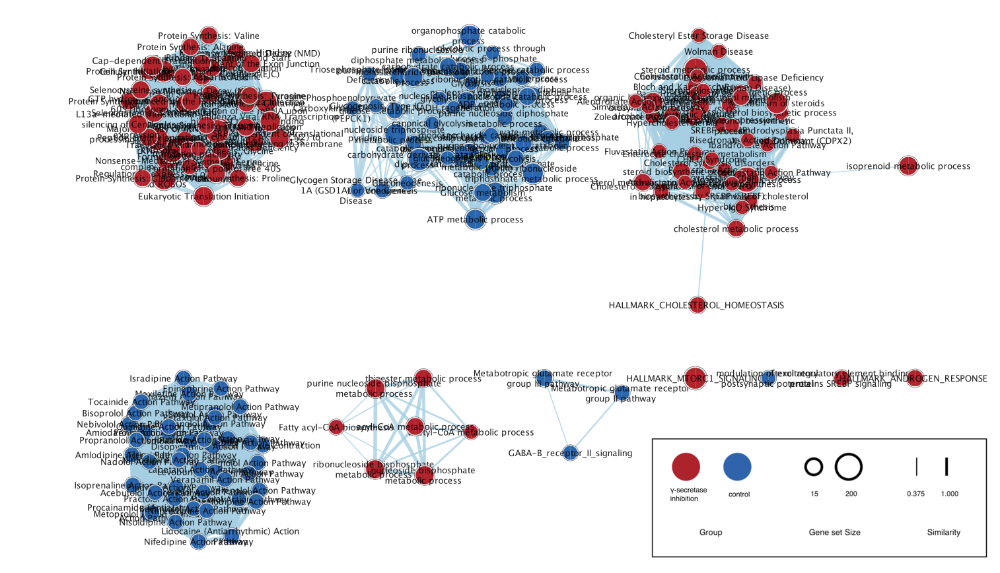
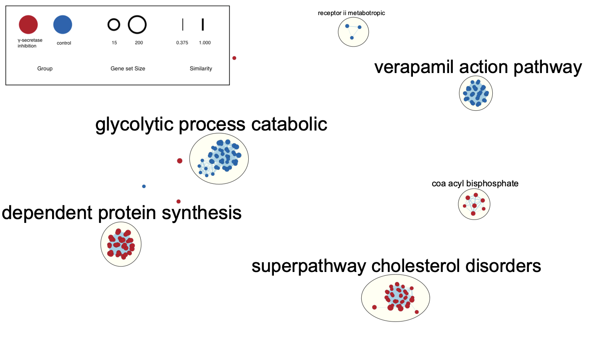

## Brief Overview of Assignment 1 and 2
In Assignment #1, a dataset with GEO ID **GSE206102** was downloaded, cleaned,
and normalized for subsequent analysis in the following assignments. The final 
dataset coverage is 14244 genes; each condition ended up having four total 
replicates following normalization.

The RNA-seq experiment associated with this dataset was conducted over six 
biological replicates of induced neuronal cells. There were three treatments: 
control (0.6% DMSO), DAPT(40 uM), and LY411575(2.5 uM). The latter two 
treatments were used to chronically inhibit γ-secretase. γ-secretase 
inhibition is known to lowered cellular cholesterol ester levels and reduce
endocytosis of the low-density lipoprotein receptor (LDLR). However, No studies 
were carried out in human neurons. A more detailed overview about the dataset
in the analysis can be found in the full write-up for Assignment #1.

In Assignment #2, the normalized expression data from the previous assignment
was used to rank the genes according to differential expression. With this 
ranked list, we performed over-representation analysis with thresholds to 
highlight the dominant similarities in the top set of genes. 
Through this analysis, 91 and 437 genes were identified as being statistically 
signficant when using FDR < 0.1 and p < 0.05 as a cutoff respectively. 

Finally, a thresholded gene set enrichment analysis was performed using 
G:Profiler. Applying thresholds of FDR < 0.1, we identify 1153 genesets for 
upregulated genes (logFC > 0), 1330 for downregulated genes (logFC > 0), and 
1957 for the combined list. Upon further refinement by filtering for term sizes 
less than or equal to 200, our analysis yields 678 genesets for upregulated 
genes, 795 for downregulated genes, and 1333 for the combined list.

## Objective of Assignment 3
The object for this assignment is to conduct non-thresholded gene set 
enrichment analysis using the ranked set of genes from Assignment #2. We will 
then compare these findings to the results from the thresholded analysis in the
previous assignment. 

## Installing dependencies and dowloading the packages
<br>
These dependencies has are already included with the command in the docker file.

```{r setup, message=FALSE}

if (!requireNamespace("BiocManager", quietly = TRUE)){
  install.packages("BiocManager")}

if (!requireNamespace("GEOmetadb", quietly = TRUE)){
  BiocManager::install("GEOmetadb")}

if (!requireNamespace("GEOmetadb", quietly = TRUE)){
  install.packages("knitr")}

if (!requireNamespace("edgeR", quietly = TRUE)){
  BiocManager::install("edgeR")}

if (!requireNamespace("biomaRt", quietly = TRUE)){
  BiocManager::install("biomaRt")}

if (!requireNamespace("DBI", quietly = TRUE)){
  install.packages("DBI")}

if (!requireNamespace("GEOquery", quietly = TRUE)){
  BiocManager::install("GEOquery")}

if(! requireNamespace("RCurl")) {
  install.packages("RCurl")}

if(! requireNamespace("RCy3")) {
  BiocManager::install("RCy3")}

if(! requireNamespace("httr")){
  install.packages("httr")} 

if(! requireNamespace("fgsea")){
  install.packages("fgsea")}

if(! requireNamespace("GSA")){
  BiocManager::install("GSA")}

library(GEOquery)
library(knitr)
library(edgeR)
library(biomaRt)
library(dplyr)
library(purrr)
library(ComplexHeatmap)
library(ggplot2)
library(circlize)
library(gprofiler2)
library(magrittr)
library(RCy3)
library(httr)
library(RCurl)
library(fgsea)
library(GSA)
```

## Non-thresholded Gene set Enrichment Analysis
The first step for this assignment is to perform non-thresholded gene set 
enrichment analysis

### Downloading the Gene Set
We must first obtain the Bader gene set before we can begin our analysis if it 
has not been already downloaded. This will be the dataset we use for determining
pathway enrichment in the GSEA analysi. 


```{r results = "hide"}
# Set gene-set file
geneset_file <- "Human_GOBP_AllPathways_noPFOCR_no_GO_iea_March_01_2024_symbol.gmt" 

# Check if geneset does not exist, then download it
if(! file.exists(geneset_file)){
  
  # URL to get most recent gene set
  gmt_url = "http://download.baderlab.org/EM_Genesets/current_release/Human/symbol/"

  # Connect to URL and get html version of the page
  filenames = getURL(gmt_url)
  tc = textConnection(filenames)
  contents = readLines(tc)
  close(tc)
  
  # Create regular expression that will match the relevant file on the html page
  rx = gregexpr("(?<=<a href=\")(.*.GOBP_AllPathways_noPFOCR_no_GO_iea.*.)(.gmt)(?=\">)", contents,
                perl = TRUE)
  
  # Get file names that match the regular expression
  gmt_file = unlist(regmatches(contents, rx))
  
  # Specify path of where to download the file
  geneset_file <- file.path(gmt_file)
  
  # Download the file
  download.file(paste(gmt_url, gmt_file, sep=""), destfile = geneset_file)
}
```

Next, we calculate the ranks of each differentially-expressed gene and order 
them in descending order to create a ranked gene list.

```{r eval=TRUE}
# Get results from differential expression analysis in Assignment 2
de_df <- read.table(file = "top_outputs.txt", header = TRUE, sep = "\t")

# Create ranked dataframe
ranked_list <- data.frame(GeneName = rownames(de_df), 
                          rank = -log(de_df$PValue, base = 10) * sign(de_df$logFC))

# Ordered ranked dataframe in descending order by rank
ranked_list <- ranked_list[order(-ranked_list$rank),]

# Save ranked list
if(! file.exists("a3_ranked.rnk")){
  write.table(ranked_list, "a3_ranked.rnk", quote=FALSE, sep='\t', row.names = FALSE)
}
```

### Run GSEA

Now that we have the ranked list and gene set ready, we can perform GSEA. Note
that in order to run GSEA on R, we will be using the `fgsea` package. 
```{r eval=TRUE}
run_gsea = TRUE # Set to TRUE if running GSEA
```

```{r eval=TRUE}
if (run_gsea) {
  
  # Read gene sets from GMT file
  genesets <- gmtPathways(geneset_file)
  
  rank_stats <- ranked_list$rank
  names(rank_stats) <- ranked_list$GeneName
  
  # Run GSEA
  fgseaRes <- fgsea(pathways = genesets, 
                    stats = rank_stats, 
                    minSize  = 15,
                    maxSize  = 200,
                    nperm = 10000)
  
}

```

Note that the output from `fgsea` is different from the output we would expect
from the original `GSEA` application. Thus, we must parse the output from 
`fgsea` so that we have two files: one for the results with NES > 0 and one for 
the results with NES < 0.

```{r eval=TRUE}
format_fgsea_results <- function(current_fgsea_results, current_ranks) {
    # Calculate the rank at max
    # fgsea returns the leading edge. Just need to extract the highest rank from 
    # set to get the rank at max
    calculated_rank_at_max <- apply(current_fgsea_results, 1, FUN = function(x) { 
        max(which(names(current_ranks) %in% unlist(x[8])))
    })
    
    # The last column is a comma-separated list of genes that are found in the leading edge.
    # (Technically GSEA doesn't need this and the column will be ignored,
    # but you have to put something in that column, might as put something that might be useful)
    gsea_results <- cbind(current_fgsea_results$pathway,
                          current_fgsea_results$pathway,
                          "Details ...",
                          current_fgsea_results$size,
                          current_fgsea_results$ES,
                          current_fgsea_results$NES,
                          current_fgsea_results$pval,
                          current_fgsea_results$padj,
                          0,
                          calculated_rank_at_max,
                          apply(current_fgsea_results, 1, FUN = function(x) {
                              paste(unlist(x[8]), collapse = ",")
                          })) 
    
    colnames(gsea_results) <- c("name", "description", "GS DETAILS", "SIZE", 
                                "ES", "NES", "pval", "padj", "FWER", 
                                "Rank at Max", "leading edge genes")
    
    return(gsea_results)
}

top_pathways_pos <- format_fgsea_results(fgseaRes[NES > 0], rank_stats)
top_pathways_neg <- format_fgsea_results(fgseaRes[NES < 0], rank_stats)

write.table(top_pathways_pos, 
            file = "gsea_report_for_na_pos.tsv", sep = "\t", 
            row.names = FALSE,
            quote = FALSE)

write.table(top_pathways_neg, 
            file = "gsea_report_for_na_neg.tsv", sep = "\t", 
            row.names = FALSE,
            quote = FALSE)

```

Table 1: Top enriched pathways for γ-secretase inhibition group
```{r echo=FALSE}
fgseaRes[NES > 0][order(fgseaRes[NES > 0]$padj), ]
```
Table 2: Top enriched pathways for non γ-secretase inhibition group
```{r echo=FALSE}
fgseaRes[NES < 0][order(fgseaRes[NES > 0]$padj), ]
```
In general, we see significant enrichment in pathways that govern metabolic 
processes in the γ-secretase inhibition group, specifically in regards to 
cholesterol biosynthesis. Interestingly, this matches closely to 
what was observed in the ORA results in the previous assignment, with many of 
the up-regulated pathways also relating to cholesterol production. Furthermore, 
there seems to be enriched pathways for the control group that are related to 
catalytic processes such as glycolysis. These patterns were observed in the ORA
results for a few of the down-regulated genes. Overall, This may imply that 
there is a strong pre-existing signal that could be captured by both 
methodologies. 

That said, this comparison is not very straightforward, as the the gene sets 
used in each method are not identical. More specifically, this analysis relies
on the BaderLab gene sets from March 2024, which were curated from multiple 
sources. However, the over-representation analysis used the GO biological 
process, Reactome, and WikiPathways as annotation databases. Therefore, the 
conclusions we have reached rely on a qualitative assessment of gene set names 
rather than a thorough quantitative analysis.

## Visualize Gene set Enrichment Analysis using Cytoscape

The resulting map has 204 nodes and 3865 edges. The node cutoff used for this 
network is FDR Q-value of 0.01, while the edge similarity cutoff was set to
0.375. Below showcases the map without manual layout manipulation.




<br /> 
The parameters used to annotate the network were kept as default. Notably, each 
node indicates a pathway, with its size indicating the number of genes. The
color of the node indicates the phenotype that the pathway is enriched for:
red indicates γ-secretase inhibition, while blue indicates the control group. 
The edges between the nodes indicate the prescence of common genes between the
pathways and its weight represents the number in common. 

After this step, we can annotate our network to visualize the pathways that 
cluster together following this analysis. 




<br /> 
The major themes found in this clustered enrichment map seem to be processes 
governing metabolism, with a notably inclusion of pathways that all seem to 
be involved in cholesterol metabolism This is unsurprising given what the 
conclusions are from the original paper. Furthermore, each cluster seems to 
only contain a single category (either the γ-secretase inhibition or control),
which implies that the clusters fit with the model. 

## Interpretation and detailed view of results:

The results from this analysis seems to be mostly in agreement with the findings
from the original paper (Essayan-Perez & Südhof 2024). The authors noted a 
consistent trend wherein all up-regulated genes induced by prolonged γ-secretase 
inhibition in human neuronal cells were linked with cholesterol biosynthesis 
processes. Notably, the GSEA results underscore the significant enrichment of 
pathways related to cholesterol biosynthesis within the γ-secretase inhibition 
group. These results were further corroborated by the annotated gene enrichment
maps, where pathways associated fatty acid synthesis and cholesterol 
metabolism all seem to cluster closely together. 

When comparing our results with the ORA from the previous assignment, we find 
that the majority of enrichments are consistent between the two methods. As 
expected, we see that both methods identify genes and pathways that are involved
in cholesterol biosynthesis and metabolism. 

Interestingly, when looking at the control group, the GSEAS results and 
Cytoscape visualizations seem to indicate a general enrichment in pathways 
associated with catabolic pathways, such as glycolysis. Notably, glycolytic 
processes were identified as a top pathways hit for downregulated genes in the
ORA from the previous assignment. However, in general, the ORA results did not 
seem to identify any clear trends in the down-regulated genes, exhibiting
heterogeneous involvement in a diverse set of pathways. 

These catabolic pathways were not explored in the paper, as the authors seemed 
primarily interested in how γ-secretase specifically affects cholesterol 
metabolism. Perhaps more work in the future can look at how catabolic pathways 
are specifically affect by levels of γ-secretase, and their subsequent impact 
on Alzheimer's disease. 

Additional sources of literature appear to corroborate the findings presented 
in the paper and our analysis. In "Inhibition of Cholesterol Biosynthesis 
Reduces γ-Secretase Activity and Amyloid-β Generation" (Kim et al., 2016), a 
relationship between γ-secretase and cholesterol biosynthesis is similarly 
highlighted, albeit in an inverse manner. Specifically, the authors of the 
study depleted cholesterol using AY49944, a compound that impedes the final 
step of cholesterol biosynthesis. The administration of this diamine resulted 
in a significant reduction in γ-secretase activity, thereby reinforcing the 
observed association between cholesterol metabolism and γ-secretase function.

Furthermore, in "β-amyloid monomers drive up neuronal aerobic glycolysis in 
response to energy stressors" (Santangelo et al., 2021), γ-secretase inhibitor 
IX was to blocking Aβ production, which seemed to severely hinder glucose 
uptake into the neuronal cells, resulting in limited aerobic glycloysis. It is
hypothesized that loss of aerobic glycolysis may accelerate Alzheimer’s disease 
pathology. Overall, this seems to support our findings that catabolic pathways 
such as glycolytic processes are down-regulated in the γ-secretase inhibition 
group. 

### Dark Matter Analysis

Occasionally, the most interesting insights come from genes that lack existing 
information. In this analysis, we will be exploring genes exhibiting 
significant differential expression yet lack pathway annotations.

```{r eval=TRUE}
# Read in the gene set
capture.output(genesets <- GSA.read.gmt(geneset_file), file="gsa_load.out")
names(genesets$genesets) <- genesets$geneset.names
```

Next, we will identify the genes exhibiting noteworthy differential expression. 
In our context, significance will be delineated by an FDR threshold of below 
0.1. Following that, we will derive two gene lists from the analysis. 
Initially, we will compile a roster of genes associated with the pathways 
identified as enriched in our GSEA analysis. Additionally, we will retrieve the 
complete list of genes.

```{r eval=TRUE}
diff_expr_genes <- rownames(de_df[de_df$FDR < 0.1, ])

# Get all genes in enriched pathways
genes_enr_gs <- c()
for(i in 1:length(fgseaRes)){ # For every pathway in the enriched pathways
  
  # Get the genes that are in the pathway
  current_geneset <- unlist(genesets$genesets[which(genesets$geneset.names %in% fgseaRes[i])])
  genes_enr_gs <- union(genes_enr_gs, current_geneset)
}

# Get list of unique genes in the entire gene set
all_genes_gs <- unique(unlist(genesets$genesets))
```

From the acquired gene lists, we proceed to extract the significantly 
differentially expressed genes that are absent from both of the gene lists 
generated in the prior step.

```{r eval=TRUE}
# Get set of significantly differentially expressed genes not included anywhere in the geneset
no_annot <- setdiff(diff_expr_genes, all_genes_gs) 
# Get set of significantly differentially expressed genes not included in the enriched pathways
no_enr_annot <- setdiff(diff_expr_genes, fgseaRes)
```

Finally, we can produce the heatmaps for the dark matter genes.

```{r eval=TRUE}
# Get expression data 
expression <- read.table("GSE206102_normalized_filtered_RSEM_counts.txt", 
                         stringsAsFactors=FALSE)

# Get indices of significantly differentially expressed genes 
# not included anywhere in the geneset in the expression data
# no_annot_ind <- which(expression$Gene %in% no_annot) 
no_annot_ind <- which(rownames(expression) %in% no_annot)

# Scale the data
no_annot_matrix <- t(
  scale(t(as.matrix(expression[no_annot_ind,])))) 

# Create the colorscales based on if there are negative scaled count values
if(min(no_annot_matrix) < 0){
  colscale <- colorRamp2(c(min(no_annot_matrix), 0, max(no_annot_matrix)),
                           c("cornflowerblue", "white", "orange"))
} else {
  colscale <- colorRamp2(c(min(no_annot_matrix), max(no_annot_matrix)), 
                           c("white", "orange"))
}

# Create heatmap
Heatmap(no_annot_matrix,
        cluster_rows = TRUE,
        cluster_columns = TRUE,
        show_row_dend=TRUE,
        col = colscale,
        show_column_names = TRUE,
        show_row_names = FALSE,
        show_heatmap_legend=TRUE)

```

```{r eval=TRUE}
# Set of significantly differentially expressed genes not included anywhere in the geneset
no_annot
```

Visinin-like 1 emerges from the short list of dark matter genes that are not 
included anywhere in the geneset. Interestingly, it is a neuronal calcium-sensor 
protein, but is also known as a peripheral biomarker for Alzheimer's disease 
(Halbgebauer et al., 2022). It is worth noting that the non-control cells 
exclusively underwent treatment with γ-secretase inhibitors. Thus, the presence 
of VSNL1 in the list of highly differentially expressed genes underscores the 
potential impact of γ-secretase on pathways beyond cholesterol biosynthesis 
that are relevant to AD.

```{r eval=TRUE}
# Get indices of significantly differentially expressed genes 
# not included anywhere in the enriched gene lists in the expression data
no_expr_annot_ind <- which(rownames(expression) %in% no_enr_annot)

# Scale the data
no_expr_annot_matrix <- t(
  scale(t(as.matrix(expression[no_expr_annot_ind, ])))) 

# Create the colorscales based on if there are negative scaled count values
if(min(no_expr_annot_matrix) < 0){
  colscale <- colorRamp2(c(min(no_expr_annot_matrix), 0, max(no_expr_annot_matrix)),
                           c("cornflowerblue", "white", "orange"))
} else {
  colscale <- colorRamp2(c(min(no_expr_annot_matrix), max(no_expr_annot_matrix)), 
                           c("white", "orange"))
}

# Create heatmap
Heatmap(no_expr_annot_matrix,
        cluster_rows = TRUE,
        cluster_columns = TRUE,
        show_row_dend=TRUE,
        col = colscale,
        show_column_names = TRUE,
        show_row_names = FALSE,
        show_heatmap_legend=TRUE)
```

```{r eval=TRUE}
# Set of significantly differentially expressed genes not included in the enriched pathways
no_enr_annot
```

From the set of significantly differentially expressed genes not included in 
the enriched pathways, we find LDLR: Low-Density Lipoprotein Receptor. It is 
traditionally recognized for its role in regulating cholesterol 
metabolism but is garnering attention in Alzheimer's disease (AD) research. Its 
involvement may extend beyond lipid regulation, potentially influencing amyloid 
beta (Aβ) metabolism and neuronal function (Kim et al., 2009).

## References
\setlength{\parindent}{-0.2in}
\setlength{\leftskip}{0.2in}
\setlength{\parskip}{8pt}
\noindent

<div style="text-indent: -40px; padding-left: 40px;">
Bache S, Wickham H (2022). _magrittr: A Forward-Pipe Operator for R_. R package 
version 2.0.3, https://github.com/tidyverse/magrittr, 
<https://magrittr.tidyverse.org>.

Davis, S. and Meltzer, P. S. GEOquery: a bridge between the Gene Expression 
Omnibus (GEO) and BioConductor. Bioinformatics, 2007, 14, 1846-1847

Efron B, Tibshirani R (2022). _GSA: Gene Set Analysis_. R package version 
1.03.2, <http://www-stat.stanford.edu/~tibs/GSA>.

Essayan-Perez, Sofia, and Thomas C Südhof. “Neuronal γ-Secretase Regulates 
Lipid Metabolism, Linking Cholesterol to Synaptic Dysfunction in Alzheimer’s 
Disease.” Neuron, vol. 111, no. 20, 1 Oct. 2023, pp. 3176-3194.e7, 
https://doi.org/10.1016/j.neuron.2023.07.005.

Halbgebauer, S., Steinacker, P., Riedel, D., Oeckl, P., Anderl-Straub, 
S., Lombardi, J., von Arnim, C. A., Nagl, M., Giese, A., Ludolph, A. C., & 
Otto, M. (2022). Visinin-like protein 1 levels in blood and CSF as emerging 
markers for alzheimer’s and other Neurodegenerative Diseases. Alzheimer’s 
Research &amp; Therapy, 14(1). https://doi.org/10.1186/s13195-022-01122-4 

Gu Z, Eils R, Schlesner M (2016). “Complex heatmaps reveal patterns and 
correlations in multidimensional genomic data.” Bioinformatics. 
doi:10.1093/bioinformatics/btw313.

Gu Z (2022). “Complex Heatmap Visualization.” iMeta. doi:10.1002/imt2.43.

Gu Z, Gu L, Eils R, Schlesner M, Brors B (2014). “circlize implements and 
enhances circular visualization in R.” Bioinformatics, 30, 2811-2812.

Kim, J., Castellano, J. M., Jiang, H., Basak, J. M., Parsadanian, M., Pham, 
V., Mason, S. M., Paul, S. M., & Holtzman, D. M. (2009). Overexpression of 
low-density lipoprotein receptor in the brain markedly inhibits amyloid 
deposition and increases extracellular AΒ clearance. Neuron, 64(5), 632–644. https://doi.org/10.1016/j.neuron.2009.11.013 

Kim, Y., Kim, C., Jang, H. Y., & Mook-Jung, I. (2016). Inhibition of 
cholesterol biosynthesis reduces γ-secretase activity and amyloid-β generation. 
Journal of Alzheimer’s Disease, 51(4), 1057–1068. 
https://doi.org/10.3233/jad-150982 

Kolberg L, Raudvere U, Kuzmin I, Vilo J, Peterson H (2020). “gprofiler2– an 
R package for gene list functional enrichment analysis and namespace conversion 
toolset g:Profiler.” F1000Research, 9 (ELIXIR)(709). R package version 0.2.3.

Korotkevich G., Sukhov V., Sergushichev A. Fast gene set enrichment analysis. 
bioRxiv (2019), doi:10.1101/060012

Martin, Fergal J., et al. “Ensembl 2023.” Nucleic Acids Research, 
vol. 51, no. D1, 6 Jan. 2023, pp. D933–D941, pubmed.ncbi.nlm.nih.gov/36318249/, 
https://doi.org/10.1093/nar/gkac958.

Robinson MD, McCarthy DJ and Smyth GK (2010). edgeR: a Bioconductor package for 
differential expression analysis of digital gene expression data. 
Bioinformatics 26, 139-140

Santangelo, R., Giuffrida, M. L., Satriano, C., Tomasello, M. F., Zimbone, S., 
& Copani, A. (2021). Β-amyloid monomers drive up neuronal aerobic glycolysis 
in response to energy stressors. Aging, 13(14), 18033–18050. 
https://doi.org/10.18632/aging.203330 

Temple Lang D (2023). 
_RCurl: General Network (HTTP/FTP/...) Client Interface for R_. R package 
version 1.98-1.13, <https://CRAN.R-project.org/package=RCurl>.

Wickham H (2016). ggplot2: Elegant Graphics for Data Analysis. Springer-Verlag 
New York. ISBN 978-3-319-24277-4, https://ggplot2.tidyverse.org.

Wickham H (2023). _httr: Tools for Working with URLs and HTTP_. R package 
version 1.4.7, <https://CRAN.R-project.org/package=httr>.
  
Wickham H, Henry L (2023). _purrr: Functional Programming Tools_. R package 
version 1.0.2, https://github.com/tidyverse/purrr, 
<https://purrr.tidyverse.org/>.

Wickham H, François R, Henry L, Müller K, Vaughan D (2023). _dplyr: A Grammar 
of Data Manipulation_. R package version 1.1.4, 
<https://CRAN.R-project.org/package=dplyr>.
  
Yihui Xie (2015) Dynamic Documents with R and knitr. 2nd edition. Chapman and 
Hall/CRC. ISBN 978-1498716963

Mapping identifiers for the integration of genomic datasets with the 
R/Bioconductor package biomaRt. Steffen Durinck, Paul T. Spellman, Ewan Birney 
and Wolfgang Huber, Nature Protocols 4, 1184-1191 (2009).

</div>

